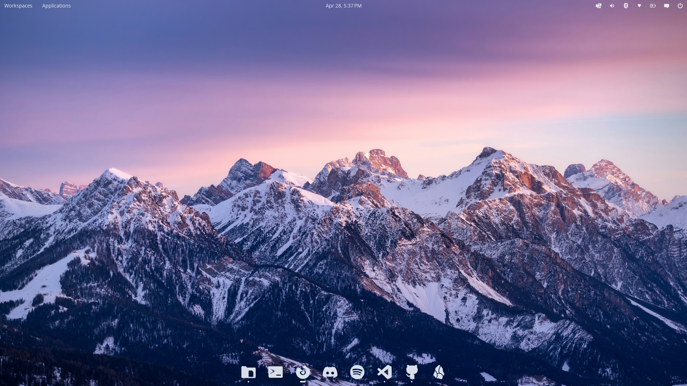

# Yet Another Monochrome Icon Set Fork for Cosmic

This is a fork of [YAMIS for KDE Plasma by Dirn](https://bitbucket.org/dirn-typo/yet-another-monochrome-icon-set) for Cosmic Desktop applications. This set includes the necessary symbolic links and App ID mappings to ensure system icons and COSMIC-specific applications display correctly across the desktop. A list of added icons can be found in [icons-added](https://github.com/harpoonwithaz/YAMIS-Cosmic/blob/main/icons-added.md). Link to page [opendesktop.org](https://www.opendesktop.org/p/2357524/).

This icon set contains a clean, monochrome icons specifically mapped and optimized for the COSMIC Desktop Environment. This set replaces standard colorful system icons with high-contrast, minimal white glyphs, making it the ideal choice for:

- Black and White: Perfectly complements "void" or high-contrast monochromatic setups.
- Clean Desktop Themes: Designed for users who prefer a distraction-free, unified interface.
- COSMIC Integration: Includes full support and symbolic links for COSMIC Settings, Terminal, Files, and App Library using proper App ID (Reverse DNS) naming conventions.

Best Paired With:

- Dark system themes.
- Minimalist or abstract wallpapers.
- Customized COSMIC panels with reduced padding.

## Installation:

COSMIC Settings > Desktop > Appearance > Icons and toolkit theming > and select YAMIS-Cosmic from the Icon Theme dropdown.

## Credit:

- Original Project: https://bitbucket.org/dirn-typo/yet-another-monochrome-icon-set/src/main/
- Original Author: Dirn
- License: This project is licensed under the GNU General Public License (GPL), consistent with the original source.

Contributions and PRs for missing icons are welcome.
